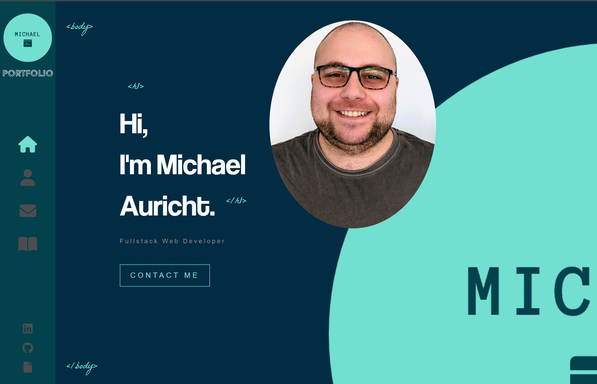

# - Portfolio -

A professional programming portfolio built with React.

### ---Functionality ---

Includes About, Contact, Home, Portfolio pages as well as direct links to GitHub and LinkedIn with a download link for Resume.

### ---Technologies Used---

Primarily React, but also using sass and animate.css to make it feel a bit more dynamic and interesting.

## ---Screenshot---

## ---Link---

[Deployed Link](https://kaleidoscopic-flan-ba0be6.netlify.app/)